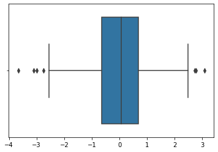

```python
import numpy as np
import matplotlib as mpl
import seaborn as sns
```


```python
data = np.random.randn(1000)
```


```python
sns.boxplot(data)
```


    <matplotlib.axes._subplots.AxesSubplot at 0x1a1f42d410>





```python

```


```python

```


```python

```
