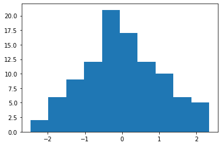
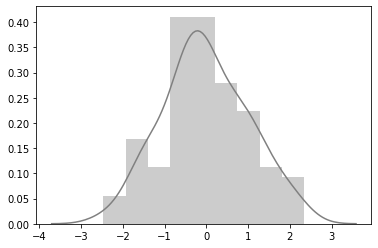
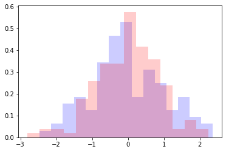
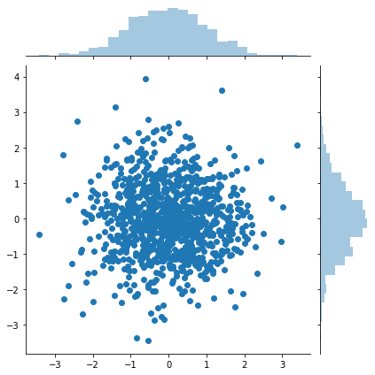
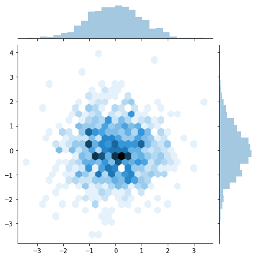

```python
import pandas as pd
import numpy as np
```


```python
import matplotlib as mpl
```


```python
import seaborn as sns
```


```python
%matplotlib inline
```


```python
data = np.random.randn(100)
data
```


    array([ 0.07733418,  0.04137898,  0.20318267, -0.18019527,  1.40953298,
            1.93157194,  0.91817347,  0.89245963, -1.6123354 , -0.6864044 ,
           -1.07846396,  0.53552125,  1.18951429, -2.46970841,  2.03510271,
           -0.02373451, -0.34909916,  0.95054549, -0.09075721, -0.7595755 ,
            0.0412331 , -1.56671641, -1.22752096, -0.37697128,  1.42067196,
            0.74134661, -0.04495654,  1.51908321, -1.44902615,  0.5729586 ,
           -1.10923052, -0.213051  , -1.00806284,  2.02510831,  1.44925988,
            0.66540469,  0.40013656, -0.6284228 ,  0.5201809 , -0.59459351,
           -0.37953417, -0.37915674, -1.42400976,  1.65906401,  0.32524994,
            1.03591533, -0.40310063, -0.78394489, -1.13781638, -0.63671822,
           -0.73243495,  1.04196665,  0.27591914, -0.26637865,  2.02953318,
            0.51578535, -1.54838833, -1.52572502, -0.00867162,  0.65044719,
           -0.67768563, -0.65766389, -1.54498757,  2.35099912, -0.05159358,
            1.55148899,  0.23248338, -0.26740229,  0.58960117, -0.07571207,
           -0.00718762,  1.11211443, -0.34289426, -0.26430213, -0.42433786,
           -0.73948419,  0.5752489 ,  1.22380671,  0.05736648, -2.06871273,
           -0.1949036 , -0.24760268, -0.00276746, -1.45347014, -1.44107142,
            0.99530498,  0.96059017, -0.53354892, -0.54088005, -1.25849349,
            1.14969782, -0.07332824,  0.30336689, -1.94693064,  0.89152983,
           -0.38296014,  0.6160608 , -0.67722571, -0.5228138 ,  0.0617637 ])


```python
mpl.pyplot.hist(data)
```


    (array([ 2.,  6.,  9., 12., 21., 17., 12., 10.,  6.,  5.]),
     array([-2.46970841, -1.98763766, -1.50556691, -1.02349615, -0.5414254 ,
            -0.05935465,  0.42271611,  0.90478686,  1.38685761,  1.86892837,
             2.35099912]),
     <a list of 10 Patch objects>)





```python
sns.distplot(data, color="grey")
```


    <matplotlib.axes._subplots.AxesSubplot at 0x1a1e7e2210>





```python
new_data = np.random.randn(150)
```


```python
mpl.pyplot.hist(data, color="blue", alpha=0.2, bins=15, density=True)
mpl.pyplot.hist(new_data, color="red", alpha=0.2, bins=15, density=True)
```


    (array([0.01981856, 0.03963712, 0.03963712, 0.01981856, 0.17836705,
            0.25764129, 0.33691554, 0.33691554, 0.57473827, 0.41618978,
            0.3567341 , 0.23782273, 0.03963712, 0.07927424, 0.03963712]),
     array([-2.80213705, -2.46575205, -2.12936705, -1.79298205, -1.45659705,
            -1.12021205, -0.78382705, -0.44744205, -0.11105705,  0.22532795,
             0.56171295,  0.89809795,  1.23448296,  1.57086796,  1.90725296,
             2.24363796]),
     <a list of 15 Patch objects>)





```python
a = np.random.randn(1000)
b = np.random.randn(1000)
```


```python
sns.jointplot(a, b)
```


    <seaborn.axisgrid.JointGrid at 0x1a1e8a6050>





```python
sns.jointplot(a, b, kind="hex")
```


    <seaborn.axisgrid.JointGrid at 0x1a1ed8e050>





```python

```


```python

```
